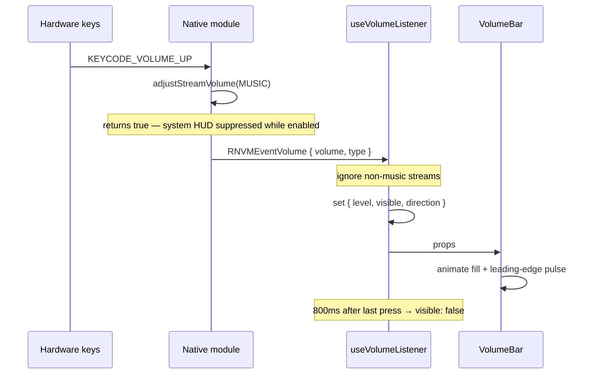

# Architecture

## The problem

On Android, pressing a hardware volume key normally shows the system volume
slider. Overriding that UI requires taking over the key press at the native
level — JavaScript alone cannot intercept it.

## How the interception works

`react-native-volume-manager` installs a key listener on the app's content view
when native volume UI is disabled:

```java
// react-native-volume-manager, Android
contentView.setOnKeyListener((v, keyCode, event) -> {
  if (showNativeVolumeUI) return false;

  switch (event.getKeyCode()) {
    case KeyEvent.KEYCODE_VOLUME_UP:
      am.adjustStreamVolume(STREAM_MUSIC, ADJUST_RAISE, FLAG_REMOVE_SOUND_AND_VIBRATE);
      return true;   // consumed — the system never sees it
    case KeyEvent.KEYCODE_VOLUME_DOWN:
      am.adjustStreamVolume(STREAM_MUSIC, ADJUST_LOWER, FLAG_REMOVE_SOUND_AND_VIBRATE);
      return true;
    default:
      return false;
  }
});
```

Two consequences shape the whole design:

1. Returning `true` **consumes** the key, so Android's own slider never opens.
2. The module adjusts the stream itself, so the app must **not** also call
   `setVolume` — that would double each press.

A `ContentObserver` on the volume stream then reports the settled value back to
JavaScript as `RNVMEventVolume`.

## Data flow



While the custom UX is switched off the same events still arrive, but the hook
records only the new level and never reveals the bar. The phone's own volume UI
is left to do its job, and switching back on picks up from the correct level
without a re-fetch.

## The enable/disable toggle

Turning the custom UX off calls `showNativeVolumeUI({ enabled: true })`, which
makes the native module drop its key listener and hand the volume keys back to
Android. Three details keep this correct:

- **The toggle owns the runtime switch; a separate unmount effect always
  restores `enabled: true`.** Collapsing them leaves the device with no volume
  UI at all once the user switches off and leaves the screen.
- **The volume subscription survives a toggle.** It is installed once and reads
  `enabled` through a ref, so flipping the switch does not drop the current
  level and re-request it.
- **Switching off hides the bar synchronously**, in the toggle handler rather
  than an effect, so the bar and the system UI are never on screen together.
  Handling it in an effect also trips React Compiler's ban on `setState` inside
  effects.

## Why the state lives where it does

`useVolumeListener` owns every interaction with the native module:

- hides the system UI on mount and restores it on unmount
- reads the starting volume
- subscribes to change events, filtered to the music stream
- derives `direction` by comparing against the previous level
- owns the auto-hide timer

`VolumeBar` receives `visible`, `level`, and `direction` and does nothing but
animate and draw. It never imports the volume library. That boundary means the
native code is confined to one file, and the bar can be rendered with arbitrary
props in isolation.

## Known limits of the interception

The listener is installed on the content view (`android.R.id.content`) rather
than by overriding the activity's `dispatchKeyEvent`. That choice is what makes
interception focus-dependent: Android delivers key events to a focused child
first, so a focused `TextInput` bypasses the listener entirely. The library
restores focus to the content view when focus leaves an input, but it cannot
intercept while one is focused.

The handler also never checks whether the key event is a press or a release, so
both events for a single physical press run the same adjust call. Volume
therefore moves two steps per press. This is harmless here because the UI renders
the absolute reported volume instead of counting presses — but it would break a
UI built on accumulating deltas.

Neither limit is worked around, because both are inherent to the library and
neither affects the demo. They are documented so the behaviour is not mistaken
for a bug in this project.

## Edge behaviour

The native observer only fires when the volume _changes_. At maximum volume, an
extra press produces no event, so the hook simply retains its previous state and
the existing hide timer runs out. Freezing at the edge is a consequence of the
native behaviour rather than a special case in the UI.

Non-Android platforms and unlinked builds are reported through `supported`,
which the screen turns into an explanatory note instead of a broken demo.
