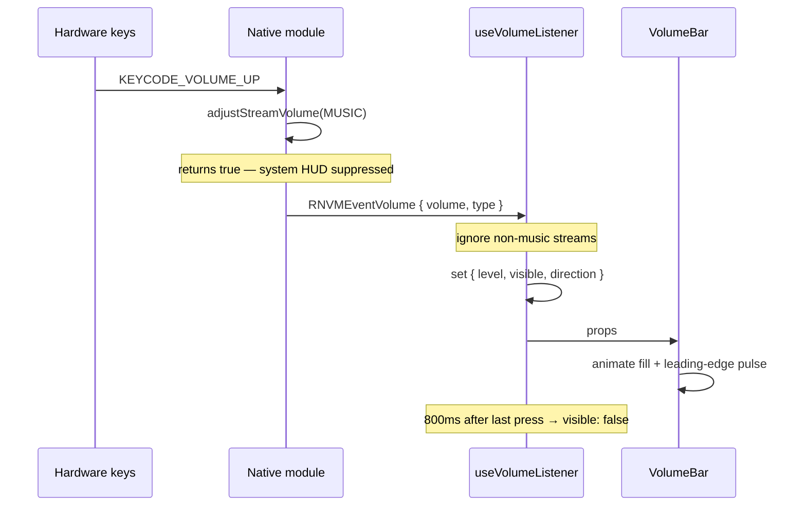

# Architecture

## The problem

On Android, pressing a hardware volume key normally shows the system volume
slider. Overriding that UI requires taking over the key press at the native
level — JavaScript alone cannot intercept it.

## How the interception works

`react-native-volume-manager` installs a key listener on the app's content view
when native volume UI is disabled:

```java
// react-native-volume-manager, Android
contentView.setOnKeyListener((v, keyCode, event) -> {
  if (showNativeVolumeUI) return false;

  switch (event.getKeyCode()) {
    case KeyEvent.KEYCODE_VOLUME_UP:
      am.adjustStreamVolume(STREAM_MUSIC, ADJUST_RAISE, FLAG_REMOVE_SOUND_AND_VIBRATE);
      return true;   // consumed — the system never sees it
    case KeyEvent.KEYCODE_VOLUME_DOWN:
      am.adjustStreamVolume(STREAM_MUSIC, ADJUST_LOWER, FLAG_REMOVE_SOUND_AND_VIBRATE);
      return true;
    default:
      return false;
  }
});
```

Two consequences shape the whole design:

1. Returning `true` **consumes** the key, so Android's own slider never opens.
2. The module adjusts the stream itself, so the app must **not** also call
   `setVolume` — that would double each press.

A `ContentObserver` on the volume stream then reports the settled value back to
JavaScript as `RNVMEventVolume`.

## Data flow



## Why the state lives where it does

`useVolumeListener` owns every interaction with the native module:

- hides the system UI on mount and restores it on unmount
- reads the starting volume
- subscribes to change events, filtered to the music stream
- derives `direction` by comparing against the previous level
- owns the auto-hide timer

`VolumeBar` receives `visible`, `level`, and `direction` and does nothing but
animate and draw. It never imports the volume library. That boundary means the
native code is confined to one file, and the bar can be rendered with arbitrary
props in isolation.

## Edge behaviour

The native observer only fires when the volume _changes_. At maximum volume, an
extra press produces no event, so the hook simply retains its previous state and
the existing hide timer runs out. Freezing at the edge is a consequence of the
native behaviour rather than a special case in the UI.

Non-Android platforms and unlinked builds are reported through `supported`,
which the screen turns into an explanatory note instead of a broken demo.
